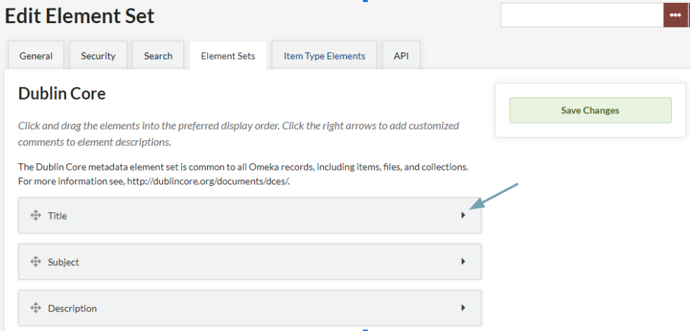
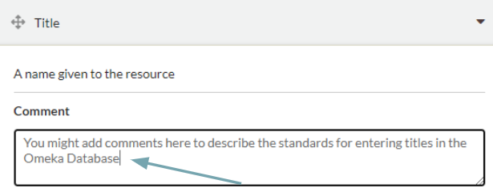

# Element Sets

Element Sets are standardized metadata categories that enable you to consistently classify, identify, and sort the digital resources in your Omeka Classic database. Element Sets utilize standardized Dublin Core metadata fields enabling you to classify the items in your database by content, format, and administrative details surrounding stewardship such as rights and preservation.

To manage your Element Sets in Omeka, select Settings in the top navigation bar. In the Settings screen, choose Element Sets.

You should see a table with the installed element sets on your Omeka Classic installation. Each row of the table will show the Name and Description for the element set. To edit an element set, click the *edit* button under the element set name. To delete an element set, click the *delete* button (note that you cannot delete the Dublin Core element set).

Annotate Elements
------------------------------------------------------

You may customize descriptions of element set metadata through adding comments to metadata fields and you may arrange the order in which the fields appear on your site.

To add comments to the metadata field descriptions, click on the arrow to the right of the name of the Dublin Core metadata element. Add your comment in the field below. Don't forget to save your changes.

Reorder Fields
-------------------------------------------------------------
To arrange the order in which the Dublin Core metadata fields appear on your site, mouse over the name of each element. Your mouse icon will become a hand. Click on the name of the element and drag and drop it to create an order appropriate for your Omeka database. Don't forget to save your changes.
