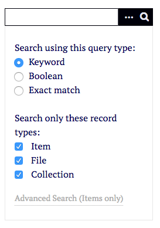

# Search Settings

This is information for managing search settings on Omeka Classic. See [the Searching page](../../GettingStarted/Searching) for information on conducting searches.

The Search Settings options allow you to set which types of records are automatically searched when a user enters terms into the basic search bar on both the admin and public sides. You can also re-index your Omeka database to ensure that all selected content is searchable.

Access the Search Settings tabs by going to the Settings tab in the top navigation (1) and then clicking over to Search (2):

## Select Record Types

As an Omeka Classic site Super administrator, you may choose which record types you wish to be searchable: items, collections, files. 

Using the checkboxes found to the left of each record type, choose which ones you want discoverable by the site-wide search. 

The basic options are: 

- Item
- File
- Collection

Additionally, if you installed the Simple Pages and Exhibit Builder plugins you may make that content available as well. Other plugins may make their content available for searching as well.

Please note that the "Exhibit" record type includes exhibit descriptive information, and an "Exhibit Page" is the actual content of the exhibit.

Be sure to save changes if you check or uncheck boxes. 

Once records types are selected, searchers use the ellipses button to choose from the options you have provided, in both admin and public site-wide searches.

## Indexing 

Indexing means to collect, parse, and store data to facilitate fast and accurate searches. Omeka Classic will automatically index individual records as they are created and saved. Re-indexing is necessary when updating from an earlier version of Omeka or after you customize which records will be searchable.

Click on the "Index Records" button to re-index your records.

