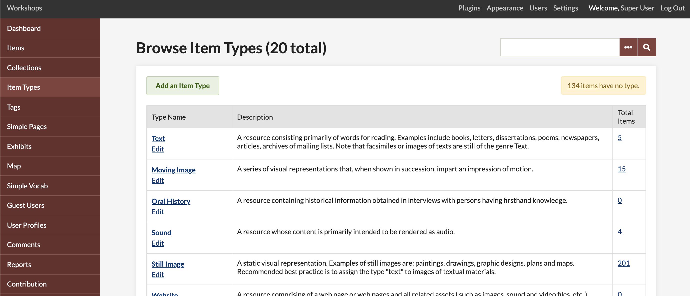
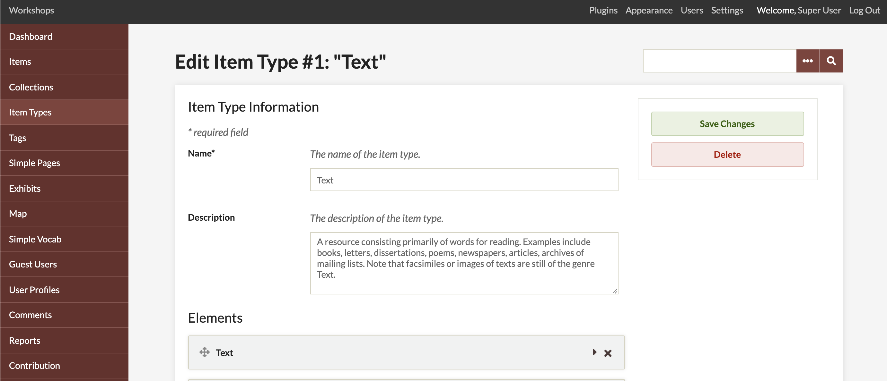
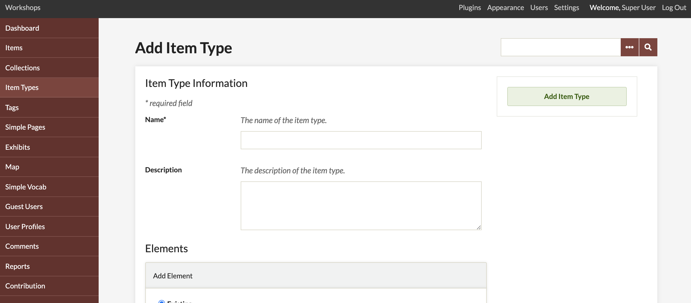
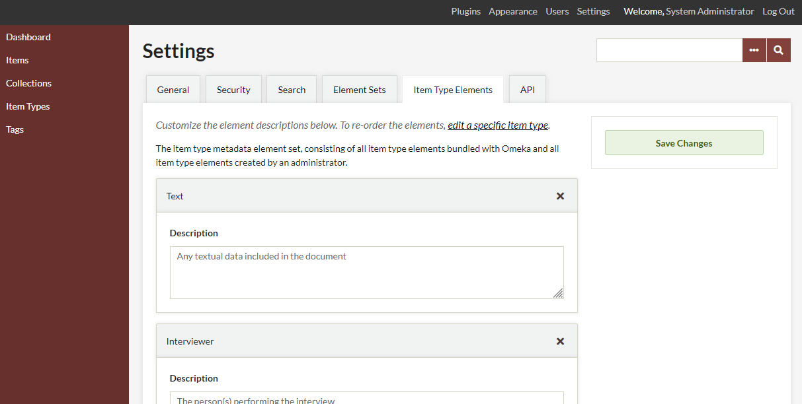

# Item Types

Item types are categories for your Omeka items based on their formats. Omeka offers you a specific set of associated metadata for each item type. Omeka comes by default with [Dublin Core item types](https://www.dublincore.org/specifications/dublin-core/dcmi-terms/#section-7){target=_blank}, but you can easily edit these or add your own.

Pre-defined Item Types
---------------------------------------------------------

-   **Document**: A resource containing textual data. Note that facsimiles or images of texts are still of the genre text.
-   **Moving Image**: A series of visual representations that, when shown in succession, impart an impression of motion.
-   **Oral History**: A resource containing historical information obtained in interviews with persons having firsthand knowledge. This may be an audio or video recording, or a transcript of a conversation. 
-   **Sound**: A resource whose content is primarily intended to be rendered as audio.
-   **Still Image**: A static visual representation. Examples of still images are: paintings, drawings, graphic designs, plans, and maps. Recommended best practice is to assign the type "text" to images of textual materials.
-   **Website**: A resource comprising a web page or web pages and all related assets (such as images, sound and video files, etc.).
-   **Event**: A non-persistent, time-based occurrence. Metadata for an event provides descriptive information that is the basis for discovery of the purpose, location, duration, and responsible agents associated with an event. Examples include an performance, battle, exhibition, webcast, conference, workshop, trial, or wedding.
-   **Email**: A resource containing textual messages and binary attachments sent electronically from one person to another or one person to many people.
-   **Lesson Plan**: Instructional materials with fields that include duration (length of time involved), standards, objectives, materials, and lesson plan text.
-   **Hyperlink**: An item that allows you to provide a URL as the main attached information. You can also attach files. Notes that entries in the URL field of this item type will not automatically be rendered into a clickable link, but you can employ the HTML editing feature to do so.
-   **Person**: An individual. Elements include biographical data, birth and death, etc.
-   **Interactive Resource**: A resource requiring interaction from the user to be understood, executed, or experienced. Examples include forms on Web pages, applets, multimedia learning objects, chat services, or virtual reality environments.

Edit an Existing Item Type 
---------------------------------------------------------------
You can edit existing item types to modify their metadata fields.

1.  Go to the Item Types page in the admin panel and click on the type you want to modify.
2.  In the next screen, click the "Edit" button. From here, you can edit or delete the current metadata fields or add new ones.
3.  When finished, click "Save Changes."

While it is possible to delete existing item types using the “delete” button on the "Browse Item Types" page, we recommend that you do not delete the predefined item types; it may cause problems should you ever want to export data, or import from another Omeka install. Rather, you should create an alternate, more customized item type and use that in your installation instead.

Create a new Item Type
--------------------------------------------------------------
To create a new Item Type, click the green “Add an Item Type" button above the table.

Each Item Type must have a *Name*, preferably unique. You can also add a *Description* to help clarify the Item Type (for example, the descriptions in the list of item types above) and guide users who are adding and describing items.

## Creating and Adding Elements

When adding elements to Item Types, there are two options: add an existing element or create a new one. You can do this to the default Item Types and any you create.

**Existing elements** are elements that have already been created for another item type, but might be applicable to yours. For example, if you were creating a “Letter” Item Type, you might add the existing “To” and “From” elements from the “Email” Item Type, and the “Text” element from the “Text” Item Type.

### To add an existing element to an Item Type: 

1. In the Add Element block, select the *Existing* option.
1. Click the green *Add Element* button.

1. In the element block which is created, select the desired element from the dropdown list. All available elements are displayed alphabetically.

**New elements** require you to enter in an element name and a description. You might need to create these for unique Item Types, for example “Cancellation Date” and “Cancellation Location” for a “Stamp” item type.

### To add a new element to an Item Type:

1. In the Add Element block, select the *New* option.
1. Click the green *Add Element* button.
1. In the element block which is created, enter an *Element Name* in the first field (toward the top of the block). Enter an *Element Description* in the larger text field. This text should help guide users who are entering metadata into this field, and can include vocabulary, structure, or formatting instructions.

You can delete elements from Item Types, by clicking the large X on the upper right corner of the element block. If it is a custom-created element, and it is no longer attached to any Item Types, it will still appear in the dropdown menu in the future. 

To delete these or existing elements from your Omeka install, go to the Settings tab, then the Item Type Elements tab. You can edit element descriptions there, or delete elements from the database.

