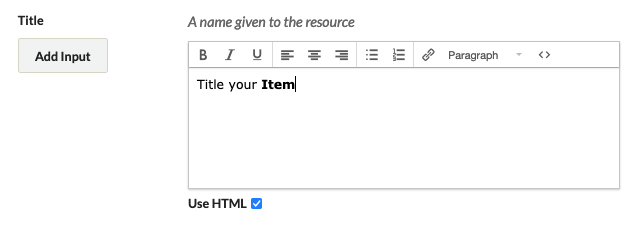
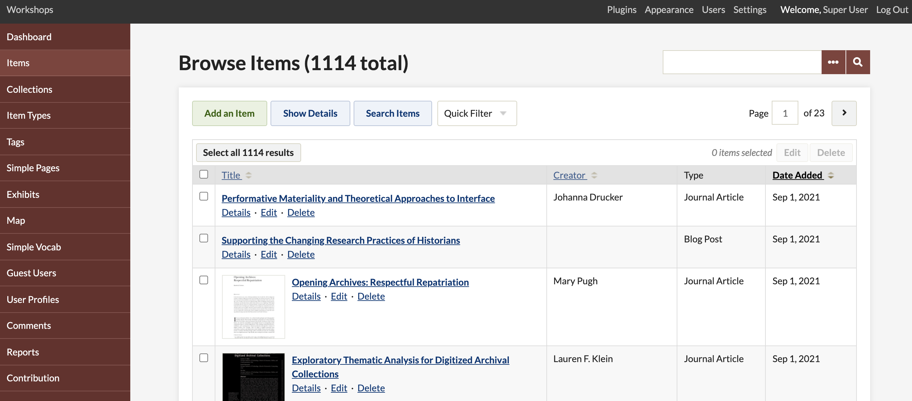
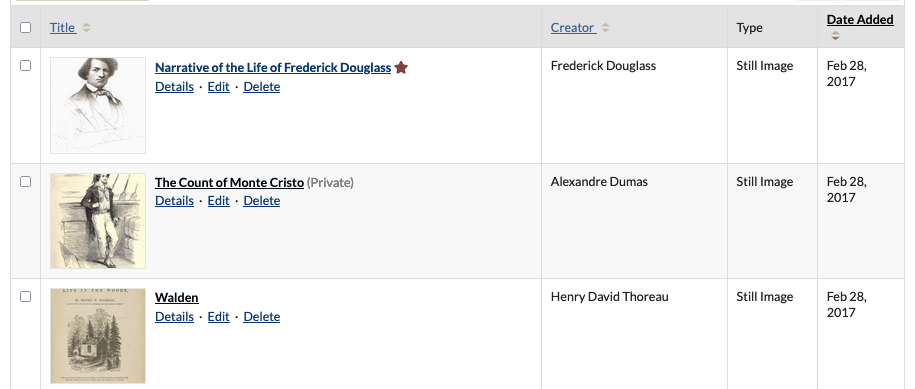
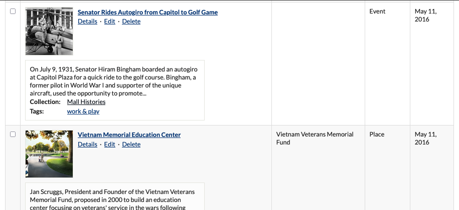
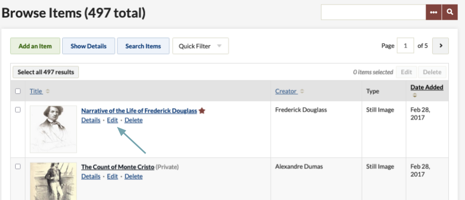

# Items

Items are the building blocks of Omeka Classic. To build your digital collections website, you must first add items.

Before Adding Items 
---------------------------------------------------------------

You may want to consult the [Site Planning Tips](../GettingStarted/Site_Planning_Tips.md) page to think about how to build your site and what you want to do with your items.

You may also want to decide what type of information you plan to share using the [Dublin Core Metadata](http://dublincore.org/documents/usageguide/) fields before adding and describing items. You may also want to read about [Working with Dublin Core](Working_with_Dublin_Core.md) for a brief explanation of metadata for Omeka items.

You may wish to work out your metadata fields as you plan batch imports using one of our plugins: [CSV Import](../Plugins/CSV_Import.md), [Dropbox](../Plugins/Dropbox.md), [Zotero](../Plugins/ZoteroImport.md), [OAI-PMH Harvester](../Plugins/OaipmhHarvester.md), or [import from another Omeka installation](../Plugins/Omeka_API_Import.md). 

Add an Item 
-------------------------------------------------------------

From your items page in the administrative interface (`https://youromekadomain.org/collections/admin/items`), click the "Add an Item" button.

This takes you to the `admin/items/add` page, where you see a navigation bar across the top pointing you to four different stages of adding an item. 

1.  The first tab shows the **Dublin Core** metadata fields. These are available for every item in the archive. 
    - Each field can have multiple values; simply click the "Add Input" button beside each field title to add a new input for that field.
    - You can use HTML in these elements if you want; see below for more information. 
1.  The **Item Type Metadata** tab lets you choose a specific [Item Type](Item_Types.md) for the object you are adding. 
    - Once you choose the type by using the drop-down menu, relevant metadata fields appear for you to complete. 
    - See [Item Types](Item_Types.md) for information about adding/editing item types.
1.  The **Files** tab lets you upload files to an item.
    - Clicking the "Add Another File" link will reveal another field for adding a file. You can associate any number of files to an item. Read more about [Files](Files.md).
1.  The **Tags** tab allows you add keyword tags to your item.
    - You must press the “Add Tags” button in order to attach tags to an item. Simple entering them in the Add Tags field will not work.

Two more steps:

1.   Make your new item “Public” and/or “Featured” with the checkboxes to the right of the item form, just under the button for "Add Item". If you do not make an item public, it will remain unseen by logged-out visitors to your site, but visible to every logged-in user no matter their [role](../Admin/Users.md#user-levels-and-access).
1.   Assign items to a [collection](Collections.md). On the right side of the page, under the "Add Item" button, is a drop-down menu where you can assign your item to a collection. You cannot create a new collection from this menu. Remember, items can only belong to one collection.
  
To finish, click the "Add Item" button to save your data. You cannot save a draft of an item, but you can make it private if you want to edit it further before sharing it publicly.

###  Using HTML in Item Elements 

Each metadata field's text may be enhanced using basic HMTL tags. Check the HTML box below the text box to enable a visual HTML editor. 

For more information about working with the HTML editor, please read [Using the HTML Editor](Using_HTML_Editor-TinyMCE.md).

Properties of Items
-------------------------------------------------------------
Items: Each item contains Dublin Core and Item Type metadata, plus other metadata fields added by plugins. An item can belong to one collection (or none), and have an infinite number of tags. Items may contain many or no files.

Collections: May comprise different items. Items may only belong to one collection a time.

Tags: Tags can be added to any item, and an item may contain an infinite number of tags.

Browse Items in Admin
-------------------------------------------------------------
Clicking on the "Items" tab from the Dashboard or `/admin` page takes you to a list of items. By default, these are sorted with the most-recently added items at the top.

The "Browse Items" view displays items in a table. Each row is one item. There are columns for a checkbox (to select items for bulk actions), the item title, item creator, item type, and the date added. 

Click the paired up-down arrows next to the "Title", "Creator", and "Date Added" headers to sort the items by that field. 

Note that items that are not public will display "(Private)" next to the title. Items that are featured have a small star icon after the item’s title. The image below shows first a featured item (note the star), then a private item, then a general public item.

Each item has links for "Details", "Edit", or "Delete" just below its title. 

On this page, items are displayed with limited metadata, including the Title, Creator, Item Type, and Date Created. To see additional metadata associated with that item, use the "Details" link under the item's title. 

You may also use the blue "Show Details" button above the table, which will display more information for every item on the page. This will show the first few lines of each item’s description, its collection, and any associated tags.

To search all items, click the "Search Items" button, which takes you to an advanced item search page.

Edit an Item
--------------------------------------------------------------
You can edit any of the information you entered when creating an item, or add new information, from the "Items" page in the left-hand navigation. 

Find the item you want to edit in the list and click the "Edit" button below its title. 

This takes you to the item-editing page where you may make your changes, the same screen you see when you add a new item. You can add new text, tags, files, and location data, or change the existing information.

Make sure you click the "Save Changes" button when you are happy with your edits.

Delete an Item
----------------------------------------------------------------

You may delete any item from the `admin/items` page by clicking the "Delete" link found below the title. You will be asked to confirm this action.

You may also delete an item by editing the item, then clicking the "Delete" button, found to the right of the page under the link to "View Public Page".

Batch Editing & Deleting
-------------------------------------------------------------------------------------------

-   Click the "Items" tab from the Dashboard or admin screen (`admin/items`).
-   Find items that you wish to edit or delete in a batch by browsing, sorting, or searching.
-   Use the checkboxes to the left of the items' titles to select them for batch editing, or select the box at the top left of the table to select all items available on that page.
-   If you wish to batch-delete items, click the "Delete" button at the top right of the table. You will be taken to a confirmation screen that lists all the selected items by title, where you can un-select individual items if desired. 
-   If you wish to batch-edit items, click the the "Edit" button at the top right of the table. You will be taken to a batch-editing page where you may make changes.

-   You may change the following fields for each batch of selected items:
    -   public or private,
    -   feature or not featured,
    -   Item Type,
    -   Collection,
    -   add Tags to all selected items,
    -   delete items. 

You can also include Item Relations on this screen, if the [Item Relations](../Plugins/ItemRelations.md) plugin is installed.

-   You can un-check the box to the left of each item if you marked one by mistake.
-   Click "Save Changes" to edit all of the selected items.