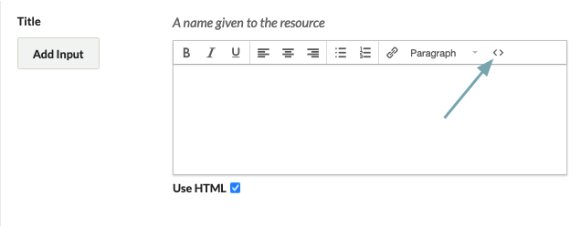
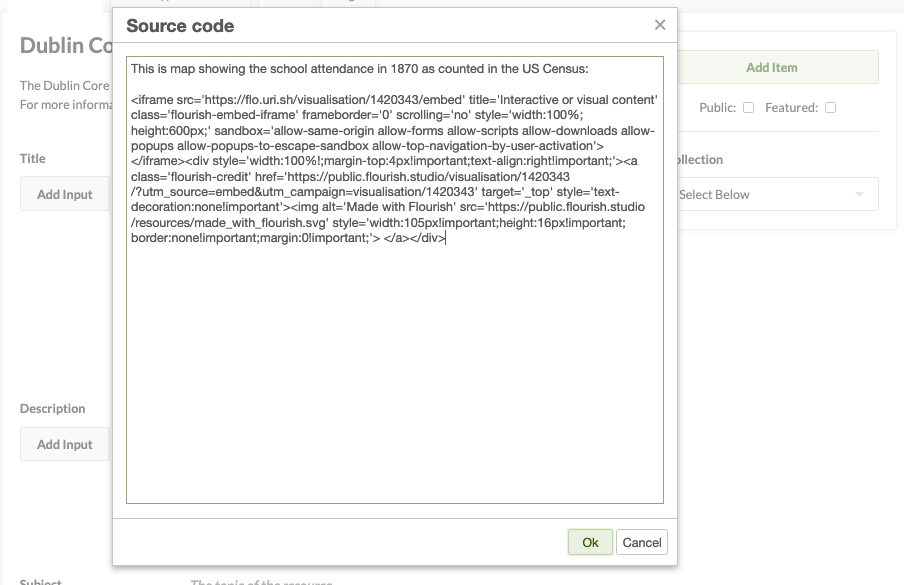

# Using the HTML Editor

Users working in the administrative side of Omeka Classic sites can use a HTML editor, powered by TinyMCE, to style and format text, to add links, and to embed multimedia.

Use the Editor
----------------------------------------------------------------
For some text boxes, such as in [Exhibit Builder](../Plugins/ExhibitBuilder.md) blocks, the editor will automatically load.

When editing items or collections, you enable the editor by clicking the check box below an element. When this is clicked, you will see a formatting toolbar at the top of the element input. This allows you to style text visually, and the editor will insert the requisite HTML behind the scenes.

Use the buttons in the toolbar to format text, change text alignment, create links and lists, and add headers. Be aware that CSS formatting in specific exhibit themes may control the appearance of this text, so the editor may not always reflect how the final page looks.

If you want to write HTML code by hand, or embed web objects such as videos, click on the code button, represented by `<>`, on the far right of the editor options.

This will open an HTML Source Editor window over the standard editing field. You may paste code snippets from Youtube or elsewhere, or write your own HTML, in the Source Editor window. 

<!--- remove this image, not needed --->

In this window, you may paste code that will embed videos or other web-generated elements. 

If you try to paste in a string of code into the text styling window rather than the HTML source editor, the text will not be saved and the object you are trying to embed will not appear on your page. 

Once you have finished coding the page, click "Update."

Allowed Tags
----------------------------------------------------------------

Omeka installations load the default rule set of allowable HTML tags from TinyMCE. For a complete list see [this default rule set from TinyMCE](http://tinymce.moxiecode.com/wiki.php/Configuration:valid_elements).

You can customize your site's list of allowed or blocked tags. To do so, go to your [security settings](../Admin/Settings/Security_Settings.md#html-filtering) and add or remove HTML tags from the Filtering box. 
