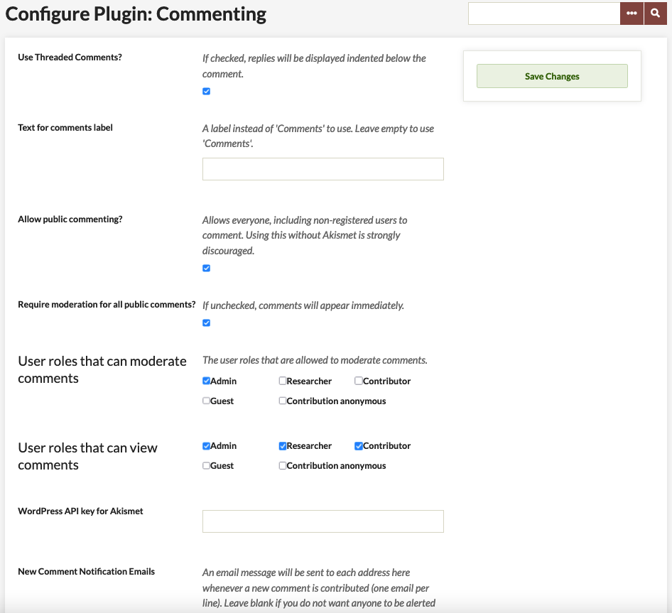
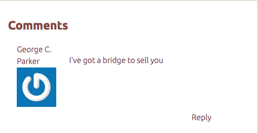
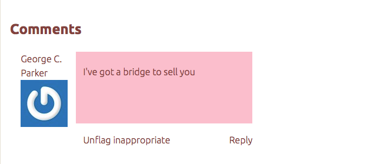

# Commenting

The Commenting plugin allows site viewers to leave comments on items and collections in an Omeka Classic site. The plugin also permits administrators to moderate those comments.

It is also possible to add commenting to pages generated by plugins such as Exhibit Builder and Simple Pages. Please see the [instructions in the plugin's README file](https://github.com/omeka/plugin-Commenting#displaying-comments) for more information on how to do so.

## Configuring

Before you can use the Commenting plugin, you must activate and configure it from the Browse Plugins page. To configure, click the blue “Configure” button beside the plugin on the Browse Plugin page. You will be prompted to select your security, moderation, and commenting preferences.

The configuration options are:

**Use Threaded Comments?**: Check to allow threaded comments, or comments that allow users to respond to another user by replying with additional comments. 

**Text for comments label**: If you wish to use a label other than “Comments,” you may enter the text here. If the field is empty, the section on the page will simply be called "Comments."

**Allow public commenting**: Check this box to allow anyone, including non-registered users, to make comments. 

**Require moderation for all public comments**: Check this to hide public comments until they have been reviewed by a moderator (see below). If unchecked, comments appear immediately (but moderators can still delete).

**User roles that can moderate comments**: Select at least one user role to moderate comments. The list will include all possible user roles, from admin to guest.

**WordPress API key for Akismet**: If you are allowing public, unmoderated commenting and you have a WordPress account, you can use your [Akismet](http://akismet.com/) API key for spam management. You may use a key you are currently implementing on a blog or another site that collects public feedback, provided that that key is not site-specific in the key settings on the Akismet site. 

In addition to Akistmet, you may want to set up [reCAPTCHA](../Admin/Settings/ReCaptcha) for your Omeka site, found in the [Security Settings](../Admin/Settings/Security_Settings). 

**New comment notification emails**: Use this field to enter the emails to which a notification of new comments should be sent. Enter one email per line. 

## Commenting

On most themes, the fields for leaving a comment will appear below item metadata. 

## Moderating Comments

Administrators can moderate comments from the Comments tab on the left-hand menu of the admin view. 

Users with permission to moderate comments may:

- approve and unapprove, and
- flag or unflag as inappropriate.

Comments display with the name of the user in bold at the top left of the comment. Just below that is the item on which the comment was left, which functions as a link to that item's public page, and the timestamp for the comment. The text of the comment displays on its own as a block. 

To the right of comment are flags for its current status, and buttons which can be used to change the status or delete the comment. 

**Moderate Single Comment**:
Use the buttons to the right of the comment, click as needed to approve, flag, or delete the comment. 

**Batch Moderating**: You may also batch approve or unapprove and flag submissions.

1. Check the "Select All" box found just below the Comments heading, or select multiple comments from the list. using the checkboxes to the left of the comment. 
2. Then select the appropriate status you wish to assign to all of the comments.
3. These changes will be automatically saved

### Filtering Comments
Use the dropdown at the top of the Comments page, next to the Flag buttons, to filter which comments display.

You can filter by:  
- View all
- Approved
- Needs approval
- Spam
- Not spam
- Flagged
- Not flagged

This is a quick way to find comments which have been flagged by users (see below) or those which need approval. 
Note that the Spam flag is set by Akismet.

## User Flagging

Logged-in users may flag any comments they feel are inappropriate or may be spam. To do that, logged-in users should click the 'Flag Inappropriate" link for the comment in question:

That comment will be flagged as potential spam and/or inappropriate. It will only be visible to users with permission to manage comments. From the public interface, users with permission to manage comments can simply unflag the comment if it is not acceptable. If further action is needed, those users can go to the admin interface to unapprove or delete the comment if it is indeed inappropriate, report it as spam, or unflag it if it not spam or inappropriate.

Site builders might also consider defining and publishing a set of community standards so that everyone will have guidance about what is and is not considered inappropriate.
